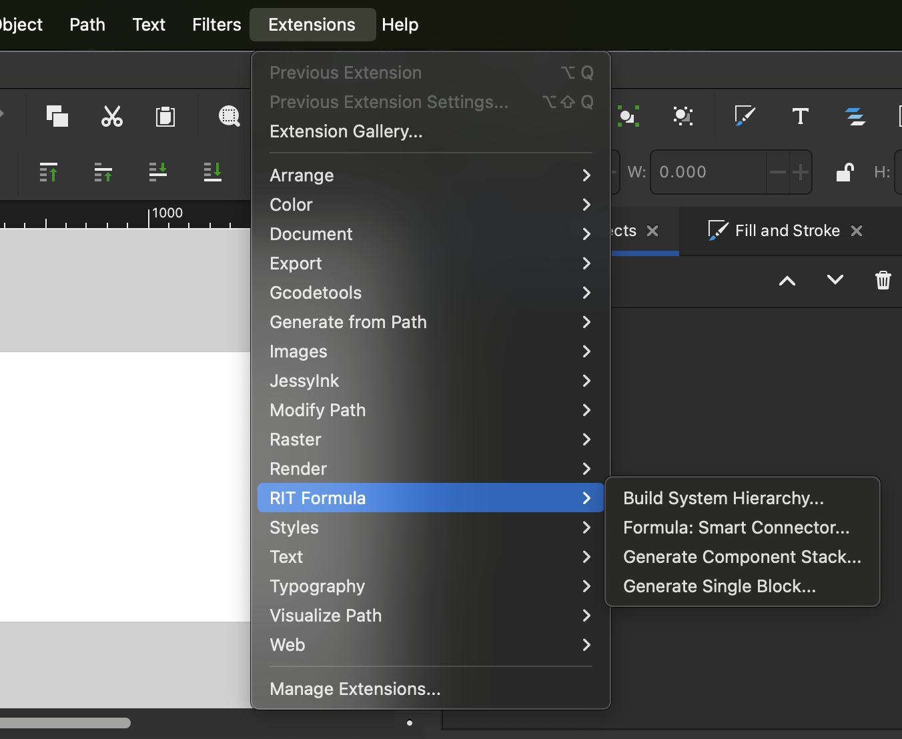
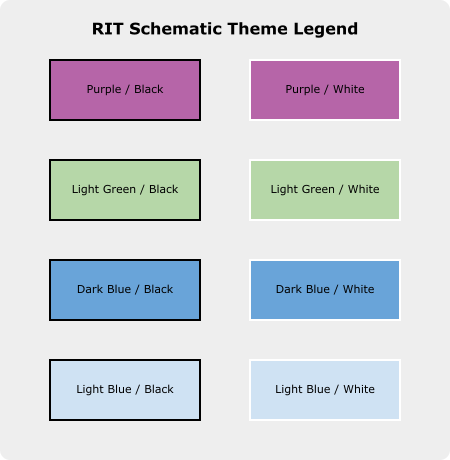
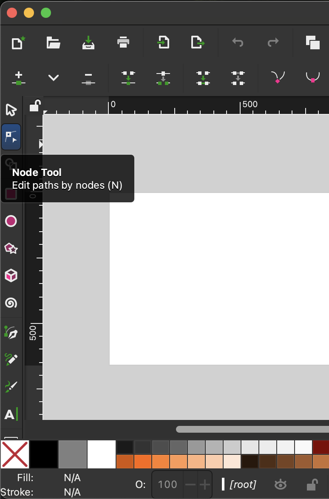
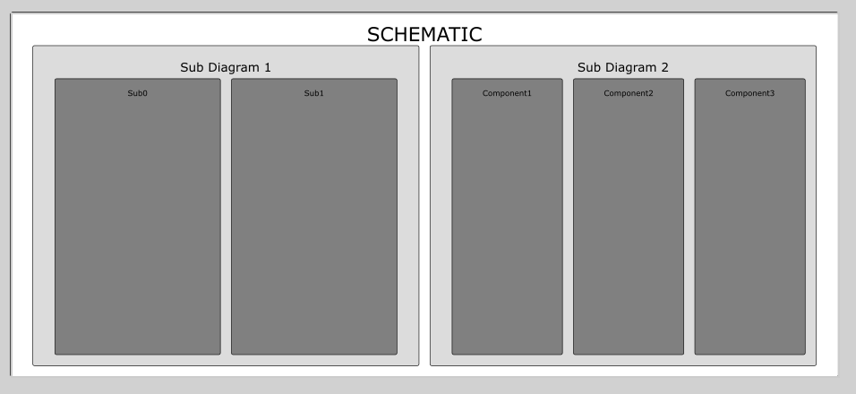
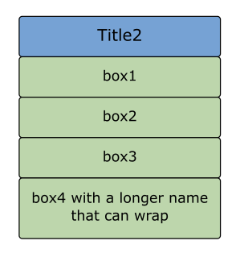

# RIT Formula Schematic Toolset for Inkscape

A suite of 4 Inkscape extensions designed to automate the creation of standardized system schematics. These tools ensure all components and connections adhere to a strict grid, consistent spacing, and consistent styling.

---

## Getting Started

### 1. Installation
To install the toolset, you must copy the extension files into your Inkscape user folder:

1.  **Locate the Folder:** In Inkscape, go to **Edit > Preferences > System**. Look for the **User extensions** path and click the "Open" icon.
>    * **macOS:** ```~/Library/Application Support/org.inkscape.Inkscape/config/inkscape/extensions/```
>    * **Windows:** ```%APPDATA%\inkscape\extensions\```
 
2. **Copy Files:** Paste all `.py`and `.inx` files into this folder. 

3. **Restart:** Close and reopen Inkscape. You will find the tools under the **Extensions > Formula** menu.
> 
### 2. Required Setup: The "Manual Kickstart"
Inkscape manages arrowheads dynamically. **Before using the Smart Connector in a new file, you must register the arrowhead:**
> 1.  Draw a temporary line with the Pen tool.
> 2.  In **Fill and Stroke (Ctrl+Shift+F) > Stroke Style**, set the **End Marker** to the **Concave Triangle / Dart** style.
> 3.  Delete the line. The ID `#ConcaveTriangle` is now registered, and the scripts can use it.

---
## Extension Library (Extension Descriptions)

### 1. Generate Single Block
Creates standardized component boxes. It gives you the options of text, location(x, y), width, height, and a **theme** as shown below.
> 

#### How to use: 
>    1.  Go to **Extensions > Formula > Box Generator**.
>    2.  Input the desired width and height (must be on a 20px grid).
>    3.  The tool generates a box with the standard stroke weight and rounded corners.

### 2. Smart Connector
Draws perfectly aligned, orthogonal (90-degree) lines between two boxes.
#### How to use:
>   1.  Select the **Source** box, then `Shift + Click` the **Target** box.
>    2.  Run the extension.
>    3.  Select which sides to connect (or use `auto`). 
>       1. `auto` decides which edge to use automatically
>    4. Select a mode:
>       1. `Orthogonal` generates lines with 90-degree corners, generating a line or S curve depending on relative locations
>       2. `Straight` generates a direct line from point to point (shortest path)
>    5. The script snaps to the 5px grid and maintains a 5px clearance gap from the box edges.

**Note:** These connectors generated by `orthogonal` mode very well may need to be fixed. 
To fix them, use the `Node Tool`, the second button on the left side menu (see picture).
This allows you to select an arrow and move around the nodes as needed.
> 

### 3. Build System Hierarchy
Generates a structured tree of boxes based on a parent-child relationship. This is designed
to be the main structure of a diagram where there is an outer title, 
and multiple subgroups on the same level. It allows for many sub-sub groups but will be limited by space after 2 sub-boxes.

#### How to use:
>  1.  Select `title`
>     1. Title will be the text at the top in large font
>  2. Select `height` and `width` (Leave these blank for fit-to-page)
>  3. Enter the desired structure in the `Diagram Structure` parameter (example below)
>     1. Each line represents a box with the title being text on each line
>     2. The first sub-boxes of the title box will have no dashes before it
>     3. For each sub-box, enter three dashes left of the line under a "parent" box
>     4. This will work "repeatedly", so to make a sub-sub box enter a line with 6 dashes after a line with 3 dashes
> 4. It will generate the child boxes aligned and spaced at a 20px grid - assuming enough space is provided

#### Example:
With input:
```angular2html
Sub Diagram 1
---Sub0
---Sub1
Sub Diagram 2
---Component1
---Component2
---Component3
```
It generates:

### 4. Generate Component Stack
Creates a vertical "stack" of identical boxes (useful for I/O ports or multi-channel ADCs).
#### How to use: 
> 1.  Open the extension and enter desired parameters as follows:
> 2.  Specify `Title` - text at the top inside a blue box
> 3. Enter box `height` and `width`
>    1. This gives the dimensions of each individual box (all identical) 
> 4. Specify `x` and `y` coordinates (Should be a multiple of 20)
> 5. Enter `Stack Contents` as follows
>    1. Each line represents the title of a box below the top title box
> 6. The stack is generated as a single aligned group.


#### Example:
With input:
```angular2html
box1
box2
box3
box4 with a longer name that can wrap
```
It generates:



---

## Standards & Troubleshooting

| Feature | Technical Requirement |
| :--- | :--- |
| **Grid Snap (Boxes)** | All containing boxes and blocks must sit on a **20px grid**. |
| **Grid Snap (Lines)** | All connecting lines must sit on a **5px grid**. |
| **Clearance (Edges)** | Blocks must be **20px** from page edges; Lines must be **10px** from page edges. |
| **Arrow Clearance** | Line ends with arrows must be pulled back by **2px** to account for arrow size. |
| **Min. Line Length** | Any line segment ending in an arrow must be at least **18px** long. |
| **Line Style** | **1px** Solid Black with **Butt** caps (ensures arrow tip is flush with the coordinate). |

### Common Fixes
* **Arrowheads invisible?** Perform the "Manual Kickstart" (Step 2 in Getting Started).
* **Lines not straight?** Ensure your boxes were created on the 20px grid. If a box is at `X = 5.2px`, the snap may cause an issue.
Use the **Align and Distribute** tool to snap boxes to the grid first.

---
**Author** | Quinn Yates (qry3977@rit.edu)

**Version 1.0.0** | Optimized for RIT Formula Schematics


